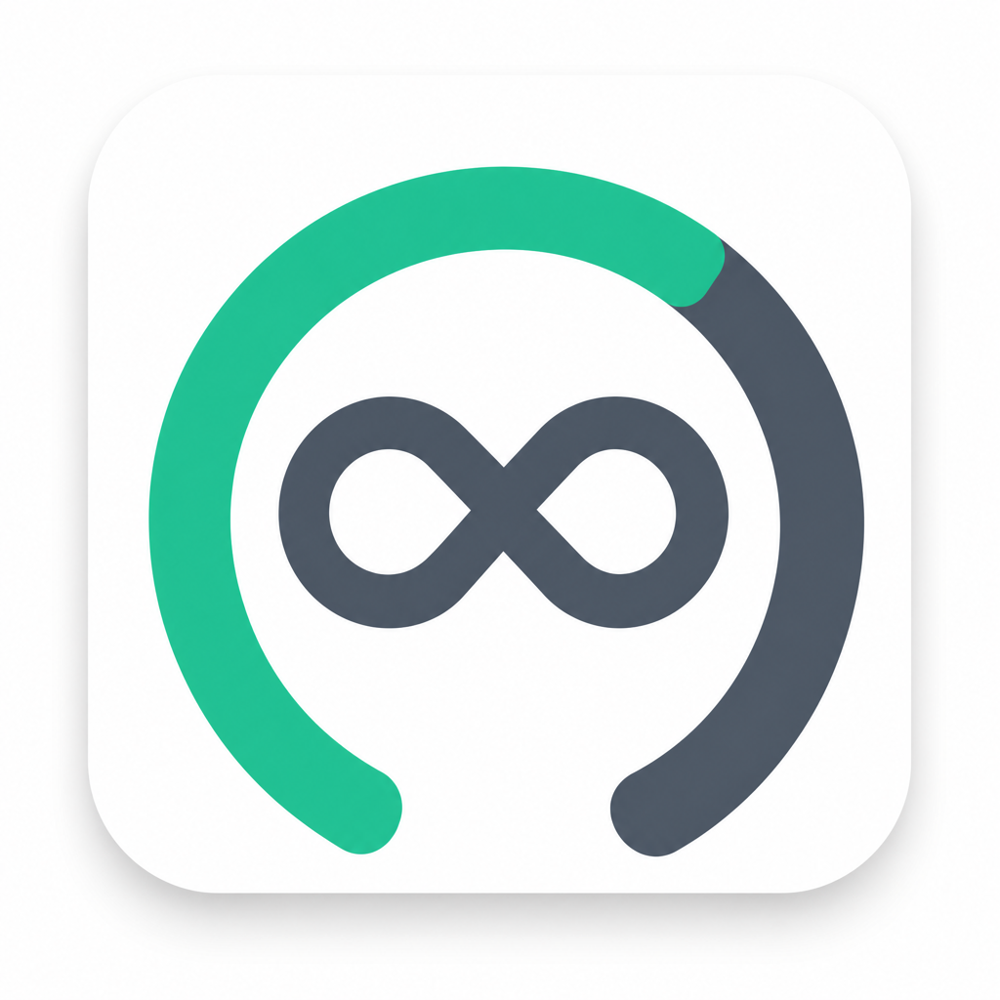
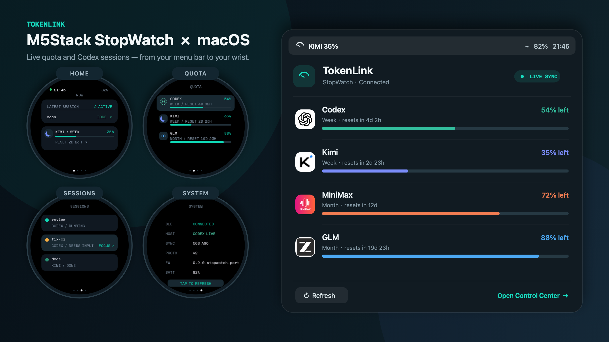

<!-- markdownlint-disable MD033 -->
<p align="center">
  <picture>
    <source media="(prefers-color-scheme: dark)" srcset="assets/branding/logo-mark-dark.png">
    
  </picture>
</p>
<!-- markdownlint-enable MD033 -->

# TokenLink

**English** | [简体中文](README.zh-Hans.md)

<!-- markdownlint-disable MD033 -->
<p align="center">
  <strong>All your AI coding quotas — on your Mac and, optionally, your wrist.</strong>
</p>
<p align="center">
  <a href="#without-an-m5stack-stopwatch"></a>
  <a href="#provider-setup"></a>
  <a href="#with-an-m5stack-stopwatch-c152"></a>
  <a href="firmware/stopwatch-c152/README.md"></a>
  <a href="#stopwatch-binding-and-protocol-v1v2"></a>
  <a href="#privacy-and-security"></a>
</p>
<p align="center">
  <a href="https://github.com/phantom5125/tokenLink/releases/latest"></a>
  <a href="https://github.com/phantom5125/tokenLink/stargazers"></a>
  <a href="https://github.com/phantom5125/tokenLink/actions/workflows/ci.yml"></a>
  <a href="LICENSE"></a>
</p>

<p align="center">
  
</p>
<p align="center"><sub>Home · Quota · Sessions · System — live from your Mac to your wrist.</sub></p>
<!-- markdownlint-enable MD033 -->

TokenLink is a native macOS menu-bar control plane for coding-plan quota and an
M5Stack StopWatch companion. Version 0.2 shows Codex, Claude, Kimi, MiniMax,
and GLM in one local interface, adds a negotiated watch protocol v2, and keeps
the existing protocol-v1 firmware path byte-compatible.

**Runs fully on your Mac without a watch.** The native menu-bar app provides the
complete experience; the C152 adds an optional ambient display and interaction
surface.

> Status: early development. Provider APIs can change without notice. The v0.2
> interface has been exercised on a C152 with protocol-v2 negotiation, aggregate
> active count, three-provider sync, and physical UI feedback. Version 0.2.1
> moved that firmware into this repository and passed its physical release
> checks. The 0.3.0 release candidate expands the Mac Cost Center into a local
> Usage & Cost workspace with multidimensional attribution, a GitHub-style
> activity calendar, period comparison, active-time estimates, custom ranges,
> and incremental history. Long-duration power behavior remains follow-up
> validation.

TokenLink is an independent open-source project and is not affiliated with,
endorsed by, or an official product of OpenAI, Moonshot AI, MiniMax, Zhipu AI,
or M5Stack. Provider names and trademarks belong to their respective owners.

## Latest News

- **2026-08-31 — TokenLink 0.3.0 RC 2 fixes distribution and first binding.**
  Every Mac icon now derives from `assets/branding`, the mounted DMG is cold-
  started to prove SwiftPM resources load from `Contents/Resources`, and C04
  Session controls no longer block C02 quota sync during first-host pairing.
- **2026-08-31 — TokenLink 0.3.0 RC 1 adds local usage analytics.** Project,
  model, reasoning-effort, and privacy-safe Session attribution now share one
  dashboard with an activity calendar, hourly trends, prior-period comparison,
  active-time estimates, custom ranges, and bounded incremental history.
- **2026-08-31 — TokenLink 0.2.3 RC 1 is ready for public testing.** The new
  TokenLink-arc quota face and Mac Cost Center ship together with request-level
  Codex token accounting, current reviewed prices, and explicit separation
  between subscription quota and API-equivalent estimates.
- **2026-08-31 — Direct Mac installation supports community and notarized
  releases.** The Mac builder produces a checked Universal 2 DMG with an
  Applications shortcut. Releases use Developer ID signing and Apple
  notarization when funded credentials are configured; otherwise the release
  and Homebrew cask explicitly identify the ad-hoc community build.
- **2026-08-30 — The 0.2.2 stability candidate is integrated.** Bluetooth
  diagnostics, explicit Codex task-link outcomes, complete thread pagination,
  stable priority slots, and accessible C152 session indicators now share one
  release branch with 190 Swift tests and thirteen firmware test executables.
- **2026-08-30 — C152 firmware moved into TokenLink.** The exact default wireless
  source, simulator tests, partition layout, MIT/OFL notices, and a pinned
  PlatformIO build now live under `firmware/stopwatch-c152`. A fresh checkout can
  build both Mac and firmware release assets without another repository.
- **2026-08-30 — The monorepo image passed its first real sync.** TokenLink 0.2.1
  build 3 paired with the freshly flashed C152 image and delivered live Codex,
  Kimi, and MiniMax protocol-v2 updates from the installed Mac app.
- **2026-08-30 — Firmware releases became machine-readable.** TokenLink now
  generates a merged C152 image, split-image archive, SHA-256 checksums, and a
  product/protocol manifest that a future local firmware server can consume.
- **2026-08-30 — The exact release candidate passed its first C152 end-to-end
  run.** Firmware revision `0d5bf6c`, archived with the TokenLink RC, booted after
  a hash-verified flash; TokenLink 0.2.0 negotiated v2 and sent live Codex, Kimi,
  and MiniMax payloads with the full active count.
- **2026-08-30 — Home now reflects the real Codex workload.** The newest task and
  its state share one compact row, while Active counts every running or
  needs-input Codex task — not only the three items sent for display.
- **2026-08-30 — Watch Face v2 reached release-candidate form.** A round-safe
  four-page interface covers Home, Quota, Sessions, and System, with matching
  provider icons and quota bars on the watch and Mac.
- **2026-08-29 — Watch and Mac became one interaction surface.** Tapping the Home
  task opens Sessions; tapping a Codex session opens its matching
  `codex://threads/<id>` task on the Mac.
- **2026-08-22 — Protocol v2 was defined.** Multi-provider quota, named work
  items, watch-to-Mac refresh/focus commands, and settings were added without
  breaking the existing v1 payload.

## What it does

- Native `MenuBarExtra` plus a five-route Control Center: Overview, Providers,
  Usage & Cost, StopWatch, and Settings & Diagnostics.
- Normalizes several quota windows without inventing plan limits.
- Projects burn rate per window ("runs out in ~3h at this pace") from recent
  local samples — no extra API calls.
- Optionally draws a fair-pace marker showing where a window would be under
  even consumption.
- Explores up to 400 days of local token usage by project, model, reasoning
  effort, and privacy-safe Session, with an activity calendar, hourly trends,
  equal-length period comparison, active-time estimates, and custom ranges.
- Persists a bounded incremental aggregate locally: unchanged transcript files
  are reused, changed files are reparsed, and prompts, replies, tool output,
  full paths, and raw Session IDs are never stored in the analytics history.
- Offers an opt-in beta scan of documented local Codex, Claude, and Kimi CLI
  transcript directories to summarize recent token counters on-device.
- Keeps cost data in a separate opt-in beta: official OpenRouter/DeepSeek
  balances stay authoritative, while local Codex/Claude/Kimi usage is always
  labelled `Estimated/API-equivalent` and priced from a reviewed bundled catalog.
- Sends macOS notifications when a window runs low, a window resets, or a
  stored credential is rejected (toggle in Settings).
- Keeps last-known-good snapshots and marks them stale when refresh fails.
- Stores explicit API keys in macOS Keychain under the user-facing `TokenLink`
  label and service `app.tokenlink.provider`. Upgrades never read the pre-0.2.1
  service automatically; the Providers screen offers a separately explained,
  user-initiated migration.
- Binds a single StopWatch by CoreBluetooth identifier and writes with response.
- Shows a credential-free connection checklist for Bluetooth permission,
  adapter, binding, progress, C04 notifications, sync, and redacted failures.
- Negotiates watch protocol v2 and sends every selected provider in one sync; v1
  firmware continues to receive only the unchanged Codex primary-window payload.
- Reads the complete paginated Codex thread list, reports the full active count,
  and keeps three stable, prioritized watch rows for focus. Focus delivers the
  matching `codex://threads/<id>` link to Codex and reports the exact delivery or
  fallback outcome without exposing the task identifier.
- Refreshes session lifecycle every ten seconds and reserves green `DONE` for
  explicit completion. Pending tasks move from animated amber `ACTION` to static
  amber `OPENED` after focus without changing their execution state; a new event
  makes them actionable again.
- Configures v2 theme, wake behavior, hour format, provider selection, and shows
  the last payload sent from the StopWatch page.
- Exports diagnostics only after redacting secrets, user paths, account labels,
  and device identifiers.

## Quick Start

### Without an M5Stack StopWatch

The fastest installation path on macOS 14 or later is the Universal 2 disk
image:

1. Download
   [`TokenLink-0.2.2.dmg`](https://github.com/phantom5125/tokenLink/releases/download/v0.2.2/TokenLink-0.2.2.dmg).
2. Open the disk image and drag **TokenLink** onto **Applications**.
3. Eject the disk image, then launch TokenLink from Applications.

Community-funded DMGs are ad-hoc signed and identify that limitation in their
release notes. When Developer ID credentials are configured, the same release
workflow signs, Apple-notarizes, staples, and Gatekeeper-verifies the artifact.

To build from source instead, install Xcode 26+ or a Swift 6.2+ toolchain:

```bash
git clone https://github.com/phantom5125/tokenLink.git
cd tokenLink
bash scripts/package_app.sh
open .build/artifacts/TokenLink.app
```

Open **Control Center → Providers**, enable Codex, and refresh. TokenLink reuses
the local Codex CLI login; no Codex API key is stored. Other providers can be
enabled independently.

The package script includes SwiftPM resources and the production TokenLink app
icon, creates a release-mode app, applies an ad-hoc signature by default, and
verifies the resulting bundle. It writes local bundles under the hidden
`.build/artifacts` directory so LaunchServices does not index a worktree build
as a second installed TokenLink. The release builder combines arm64 and x86_64,
adds an Applications shortcut, and verifies the mounted DMG before publication.

### With an M5Stack StopWatch C152

1. Complete the Mac-only steps above.
2. Install the pinned firmware tool and build everything from this checkout:

   ```bash
   python3.12 -m venv .venv-pio
   .venv-pio/bin/python -m pip install platformio==6.1.19
   bash scripts/test_firmware.sh
   bash scripts/build_firmware_artifact.sh
   ```

   The last command produces a C152-only merged image at offset `0x0`, a
   split-image archive, manifest, and checksums in `dist/firmware/`. A tagged
   [v0.2.2 release](https://github.com/phantom5125/tokenLink/releases/tag/v0.2.2)
   publishes the same asset classes for users who do not want to compile.
3. Read M5Stack's
   [factory-recovery path](https://docs.m5stack.com/en/guide/restore_factory/stopwatch),
   identify the exact newly connected Espressif `/dev/cu.*` port, and confirm
   that port immediately before flashing:

   ```bash
   bash scripts/pio.sh run -d firmware/stopwatch-c152 \
     -e m5stack-stopwatch --target upload \
     --upload-port /dev/cu.YOUR_CONFIRMED_C152_PORT

   python3 firmware/stopwatch-c152/scripts/serial_probe.py \
     /dev/cu.YOUR_CONFIRMED_C152_PORT --seconds 30 \
     --expect CODEX_MICRO_STOPWATCH_READY
   ```

4. In TokenLink, open **Control Center → StopWatch**, scan, select the exact
   device, bind it, and press **Sync watch now**.

Do not flash the C152 image to another M5Stack model, and do not expect the
four-page UI from protocol-v1 firmware. Never copy a serial port from another
user's command or documentation.

### Verify a source checkout

```bash
swift build
bash scripts/test.sh
bash scripts/test_firmware.sh
bash scripts/build_release_artifact.sh
bash scripts/build_firmware_artifact.sh
```

The two artifact commands write independently checksummed Mac and C152 assets
under `dist/`. Maintainer signing, notarization, hardware gates, and publication
steps are documented in [`docs/RELEASING.md`](docs/RELEASING.md).

## Requirements

- macOS 14 or newer
- Apple Silicon or Intel Mac with Xcode 26+ / Swift 6.2+ (Command Line Tools can
  build the app; the included test wrapper handles CLT installations whose
  Swift Testing search paths are incomplete)
- A working `codex` CLI for Codex quota
- Optional M5Stack StopWatch C152; building its firmware needs Python 3.12 and
  the repository-pinned PlatformIO Core 6.1.19

## Provider setup

Open **Control Center → Providers**. Secret fields are always blank: TokenLink
shows only whether a credential is configured — plus a masked head/tail hint of
the stored key (for example `sk-cp-ab…wxyz`) and its source (Keychain, CLI, or
environment variable) — and never reads a key back into the UI. Each provider
section links to the official console where you can create a key.

Credentials resolve in this order: an explicit key in Keychain, then the
provider's documented local CLI credential (Kimi and Claude), then a small
allowlist of environment variables (`KIMI_CODE_API_KEY`/`KIMI_API_KEY`,
`MINIMAX_API_KEY`, `ZAI_API_KEY`/`ZHIPU_API_KEY`/`GLM_API_KEY`/`BIGMODEL_API_KEY`,
`CLAUDE_CODE_OAUTH_TOKEN`). The environment fallback exists mainly for testing.

Multiple accounts per provider are supported as an advanced, not-recommended
option: use **Add account (advanced)** in a provider section to attach another
plan with its own label and key. Codex and Claude stay single-account because
they use the local CLI sign-in.

The app UI is available in English, 中文（简体）, and 日本語; choose under
**Settings & Diagnostics → Language** or follow the system language.

### Codex

TokenLink starts the local command `codex app-server --listen stdio://`, performs
the JSON-RPC initialization handshake, and reads `account/rateLimits/read`. It
reuses the Codex CLI's own login state; TokenLink does not store a Codex API key.
If `codex` is not on the app's `PATH`, set an explicit executable path.

### Kimi

You can store a Kimi Coding API key in Keychain. If no explicit key exists,
TokenLink can read the current, non-expired access token from
`~/.kimi-code/credentials/kimi-code.json`. It reads no sibling files, browser
cookies, or refresh token, and it never refreshes or writes the CLI credential.

### Claude

TokenLink reads the OAuth usage endpoint used by Claude Code's own `/usage`
display. It never requests the CLI's `Claude Code-credentials` Keychain item at
launch: enable Claude and use the explicit authorization button first. The
preflight explains that macOS grants the whole item (not the whole Keychain),
that TokenLink uses only the access token and expiry, and when “Always Allow” is
appropriate. Anthropic pay-as-you-go API keys do not report subscription quota,
so there is intentionally no key field for Claude.

### MiniMax

Store a MiniMax Coding Plan API key and choose Global or China. Requests are
restricted to the selected official host (`www.minimax.io` or `www.minimaxi.com`)
and use the Token Plan remains endpoint.

### GLM

Store a GLM Coding Plan API key and choose Global (Z.AI) or China (BigModel).
TokenLink supports the current numeric-unit/camelCase quota shape plus an explicit
legacy compatibility branch. It preserves returned windows and does not estimate
limits from a plan name.

### Costs beta

Enable **Settings & Diagnostics → Beta → Costs** to load the separate Costs
page. Cost refresh, failure, and caching are independent from quota refresh,
notifications, menu-bar severity, and StopWatch payloads. The menu bar can show
one fixed cost metric after the primary quota; unavailable selections fall back
to quota-only text.

The two cost domains are intentionally not merged:

- **Authoritative balances** come from an official provider account API.
  OpenRouter calls `/api/v1/credits` and `/api/v1/key` independently. An explicit
  Management Key can expose account credits; a regular API key may expose only
  current-key spend, which TokenLink presents as partial data instead of
  inventing a balance. DeepSeek calls `/user/balance` and preserves every
  returned currency separately, including valid zero balances. TokenLink does
  not convert currencies or infer spend from balance changes.
- **`Estimated/API-equivalent`** values can show Today, a trailing seven-day
  Week, or a trailing 30-day Month of supported local CLI token records using
  the bundled catalog's version and effective date. One bounded 30-day pass
  fills all three cached windows, so switching periods does not reopen session
  files. They estimate what equivalent API traffic would cost; they do not
  estimate, allocate, or assign monetary value to a Coding Plan subscription.
  Codex follows the common local-usage-tool formula: request-level usage is
  preferred over cumulative counters; ordinary input is `input - cache read -
  cache write`; reasoning tokens stay inside output and are not charged twice.
  Recorded `priority` / Fast requests and request-level long-context thresholds
  use the reviewed catalog multipliers before model totals are aggregated.
  Unmarked speed records fall back to the non-secret `service_tier` value in
  `.codex/config.toml`, then to Standard when no recognized value is present.
  Unknown models and token categories without a reviewed price are excluded and
  surfaced as warnings.

Cost credentials are explicit Keychain entries. TokenLink does not reuse
browser state, organization-admin credentials, or unrelated CLI credentials for
OpenRouter or DeepSeek. Balances and estimated monetary totals remain in memory
and are not written to configuration or diagnostics.

Provider and Codex-path changes are persisted immediately and take effect
after restarting the app. Region, account, and refresh-interval changes take
effect immediately.

## StopWatch binding and protocol v1/v2

1. Keep the matching StopWatch firmware running and Bluetooth enabled.
2. Open **Control Center → StopWatch** and press **Scan**.
3. Select one discovered identifier and bind it.
4. Press **Sync watch now**.

When upgrading from the previous `io.github.phantom5125.tokenlink` identity,
TokenLink 0.2.1 clears the old saved peripheral identifier and explains a
one-time rebind before Bluetooth is initialized. Pressing **Scan** is the
explicit action that can trigger the macOS Bluetooth prompt. Allowing it grants
`app.tokenlink` nearby-device discovery, connection, quota sync, and watch
command access; it does not grant Keychain access.

Discovery occurs only on explicit request. TokenLink first checks connected quota
and HID peripherals, then performs a short broad scan filtered by the StopWatch
name or private service UUID. It does not connect until you explicitly bind an
identifier. Once bound, fresh selected-provider snapshots sync automatically;
**Sync watch now** remains available as a manual action. Connect, capability-read,
notification-subscription, and write operations have finite deadlines. Quota
writes require an ATT response, and a protocol-v2 connection is not reported as
ready until macOS confirms the C04 watch-command notification subscription.
The StopWatch connection checklist exposes each of those credential-free states
and provides recovery guidance without including a peripheral UUID or payload.

The v1 firmware understands only this payload:

```json
{"remaining_percent":72,"reset_in_seconds":900}
```

Protocol v1 always sends only Codex's primary window. Kimi, Claude, MiniMax, and
GLM are never mislabeled as Codex on an existing v1 watch face.

Protocol v2 is negotiated through an optional read-only capabilities
characteristic. A compatible device can receive up to three quota windows, up
to three short named work items, selected-provider rotation, and watch settings.
Each window may include a backward-compatible `window_duration_seconds` hint so
the watch can show a time-proportional planned-remainder tick without inferring
unknown provider limits.
If capability discovery, reading, or decoding fails, TokenLink silently falls
back to v1. The Mac implementation and fake-transport tests are complete, and
the v0.2.1 release carried its full active-count field and live multi-provider
payloads to a C152. The 0.2.2 candidate adds complete pagination, stable priority
slots, focus delivery feedback, and animated/non-color session indicators;
the exact power-button wake fix is flashed and boot-verified, while physical
layout, task focus, reconnect, and visible sleep/wake review remain the final
candidate validation layer. See the latest report in [`docs/validation`](docs/validation/).

## Privacy and security

- Explicit API keys: macOS Keychain only.
- Non-secret configuration: `~/Library/Application Support/TokenLink/config.json`
  with user-only permissions.
- No browser-cookie access, Full Disk Access, analytics, or remote TokenLink
  service.
- The optional local-usage and cost betas read only `.codex/sessions`, the
  top-level `service_tier` setting in `.codex/config.toml`,
  `.claude/projects`, and `.kimi-code/sessions`; they extract token counters
  locally and never send transcript data over the network.
- Local scans stream 64 KiB chunks, process files sequentially, skip files over
  256 MiB and records over 1 MiB, and retain neither raw transcript content nor
  monetary snapshots. There is no telemetry.
- Provider URLs are HTTPS and checked against narrow official-host allowlists
  before credential-bearing requests.
- Diagnostics are redacted before they are written to a user-selected file.

See [SECURITY.md](SECURITY.md) for reporting and threat-boundary details.

## Troubleshooting

- **Codex unavailable:** run `codex --version`, confirm the CLI is signed in, and
  set its path in Providers if the menu-bar app has a smaller `PATH`.
- **Credential needed:** replace the provider key in Providers. The old value is
  intentionally never displayed.
- **Stale quota:** TokenLink keeps the last successful snapshot and labels it
  stale; use Refresh after network access returns.
- **No StopWatch discovered:** confirm the firmware exposes the private quota
  GATT service or the `Codex Micro` device name, grant Bluetooth access when macOS
  asks, and scan again.
- **Launch at login requires approval:** enable TokenLink in System Settings →
  General → Login Items.

## Uninstall

Quit TokenLink and remove `TokenLink.app`. Optionally remove its configuration:

```bash
rm -rf "$HOME/Library/Application Support/TokenLink"
```

Keychain items can be removed from Keychain Access, or individually with the
`security` command using service `app.tokenlink.provider` and
accounts `kimi`, `minimax`, or `glm`. A completed upgrade migration deliberately
keeps recovery copies under `io.github.phantom5125.tokenlink.provider`; remove
those manually in Keychain Access after confirming the new credentials work.

## Architecture

```text
TokenLinkApp        SwiftUI/AppKit state, settings, Keychain, diagnostics
  ├─ TokenLinkCore       provider-neutral quota and refresh state
  ├─ TokenLinkProviders  Codex/Claude/Kimi/MiniMax/GLM adapters and host policy
  └─ TokenLinkDevice     v1/v2 projection, negotiation, commands, CoreBluetooth

firmware/
  ├─ catalog.json              product/build/protocol registry
  └─ stopwatch-c152/           PlatformIO C152 firmware, UI, and native tests
```

Each provider owns a fixture-tested parser and emits a shared `QuotaSnapshot`.
The app is the only UI state owner. The device layer receives deliberate v1 or
v2 projections and never receives provider credentials.

Cost-only providers use separate adapters, state, refresh coordination, and UI
models; they never receive synthetic quota snapshots or enter watch payloads.

## Resource and privacy gates

CI runs `scripts/resource_check.sh` after the regular macOS test job. The gate
streams and parses a deterministic 64 MiB workload through the production JSONL
reader, then enforces a maximum 160 MiB RSS, 30-second elapsed time, and 15 MiB
release executable. Compiler processes are excluded from the measurement.

`scripts/privacy_scan.sh` rejects secret-like values and production logging of
balances, raw monetary values, authorization headers, raw response bodies, or
transcript paths. Diagnostics separately test that amounts, model identifiers,
account labels/UUIDs, error text, and paths cannot enter exported metadata.

## Protocol-v2 status

The Mac side implements payload projection, capability negotiation, v1 fallback,
provider rotation, three visible work-item slots, a full active-task count,
settings, payload preview, and a watch-to-Mac command channel. The matching
four-page C152 firmware, touch focus commands, optional pet theme, raise-to-wake,
and host-native tests now live in `firmware/stopwatch-c152`. The firmware subtree
is independently licensed under MIT and speaks the same v1/v2 contract used by
`TokenLinkDevice`. The previous release candidate has a verified C152 flash,
boot, protocol-v2 exchange, multi-provider sync, and user-observed UI iteration;
the v0.2.1 rebuild has its own flash, boot, live-sync, reconnect, C04 command,
physical UI, and session-focus acceptance record. The 0.2.2 integration adds
diagnostics, complete pagination, focus feedback, and clearer session status;
its physical checklist and the 24-hour power soak remain separate evidence.

## Roadmap: extensible watch faces

The 0.3.x line will gradually separate semantic watch state from rendering.
0.3.0 introduces a shared face-state/runtime boundary for the built-in Data and
Pet faces without enabling third-party installation. Later 0.3.x releases add a
declarative `.tokenface` package schema, deterministic validation and preview,
then a hash-verified BLE install/rollback flow and an opt-in local-authoring beta.
Packages will not execute native code or scripts. A public community gallery is
a separate 0.4.0+ decision, not a prerequisite for local packages. See the
[extensible watch-face roadmap](docs/plans/2026-08-30-extensible-watch-face-roadmap.md).

## Contributing

Contributions and well-formed ideas are welcome. Small fixes may be submitted
directly; large UI, protocol, provider, or hardware changes should begin with an
issue proposal. See [CONTRIBUTING.md](CONTRIBUTING.md), the
[Code of Conduct](CODE_OF_CONDUCT.md), and the existing issue templates.

## License and acknowledgements

TokenLink's Mac and shared source are licensed under the
[Apache License 2.0](LICENSE). The imported C152 firmware retains its own
[MIT license](firmware/stopwatch-c152/LICENSE) and Space Mono retains its OFL.
Required attributions are in [NOTICE](NOTICE), and brand-use boundaries are in
[TRADEMARKS.md](TRADEMARKS.md).
