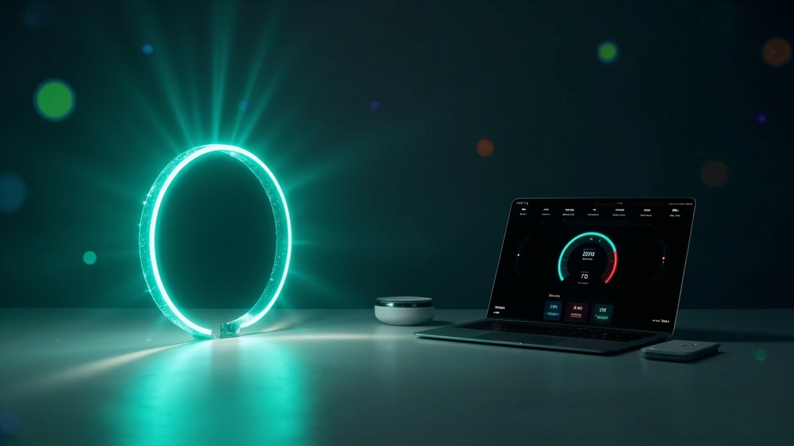

# TokenLink

[](https://github.com/phantom5125/tokenLink/actions/workflows/ci.yml)
[](LICENSE)

<!-- markdownlint-disable MD033 -->
<p align="center">
  
</p>
<!-- markdownlint-enable MD033 -->

TokenLink is a native macOS menu-bar control plane that shows your AI coding
plan quota — Codex, Kimi, MiniMax, and GLM — in one place, and syncs the Codex
primary window to the M5Stack StopWatch over Bluetooth (GATT protocol v1).

**Your AI quota, at a glance.**

## Features

- Menu-bar gauge with the most constrained quota window across providers.
- Control-center window: Overview, Providers, StopWatch, Settings & Diagnostics.
- Four independent provider adapters with per-provider HTTPS host allowlists.
- API keys live in the macOS Keychain; config JSON never contains secrets.
- StopWatch sync: only the Codex primary window is projected to the legacy
  watch payload — other providers are never mislabeled as Codex.
- Last-known-good caching with honest stale/error display.
- Redacted diagnostics export.

## Architecture

TokenLink keeps platform responsibilities separate:

| Module | Responsibility |
| --- | --- |
| `TokenLinkCore` | Quota models, state, and refresh coordination |
| `TokenLinkProviders` | Provider parsers, endpoint policies, and fetchers |
| `TokenLinkDevice` | Bluetooth transport and StopWatch projection |
| `TokenLinkApp` | SwiftUI, configuration, Keychain, and live assembly |

Provider and hardware boundaries are intentionally narrow so new integrations
can be developed like adapters. They are currently compiled into the app;
TokenLink does not yet expose a dynamic plugin ABI.

## Requirements

- macOS 14 or newer.
- Swift 6.2 toolchain or newer (Xcode for full packaging and UI automation).
- M5Stack StopWatch Dev Kit (C152) for watch sync.

## Build & run

```bash
swift build
swift test        # full Xcode required for the test runner
swift run tokenlink
```

Package a signed `.app`:

```bash
bash scripts/package_app.sh   # builds TokenLink.app and ad-hoc signs it
open TokenLink.app
```

## Provider setup

Open **Control Center → Providers**. Keys are stored in Keychain and are never
prefilled back into text fields.

| Provider | Credential |
| --- | --- |
| Codex | Reads the local `codex` CLI app server; no key needed. |
| Kimi | Coding Plan API key, or read-only reuse of the Kimi Code CLI login. |
| MiniMax | Coding Plan API key; choose Global or China region in Settings. |
| GLM | Coding Plan API key; Global (`api.z.ai`) or China (`open.bigmodel.cn`). |

## StopWatch binding

1. Open **Control Center → StopWatch → Discover…** to start an explicit
   discovery session.
2. Select your device from the list — binding requires a selection.
3. Use **Sync Codex now** to push the current Codex primary quota.

Protocol v1 sends only `remaining_percent` and `reset_in_seconds` for the
Codex primary window. Protocol v2 (multiple windows, provider IDs, watch-face
rotation) is a separate upcoming project.

## Privacy

TokenLink runs fully on-device: no local web server, no daemon, no browser
cookies, no Full Disk Access. See [SECURITY.md](SECURITY.md) for secret handling
and `scripts/privacy_scan.sh` for the CI-enforced privacy rules.

## Troubleshooting

- **Missing credential**: the provider row shows "Not configured" — add the key
  in Providers, or sign in with the Kimi Code CLI for Kimi.
- **Stale data**: rows show the original fetch time in orange; hit Refresh.
- **Codex not found**: set a custom `codex` path in `config.json`.

## Uninstall

Quit from the menu bar, remove `TokenLink.app`, then delete
`~/Library/Application Support/TokenLink` and the Keychain entries under
`io.github.phantom5125.tokenlink.provider`.

## Contributing

Contributions and well-formed ideas are welcome.

- Small, verifiable bug fixes, tests, and documentation corrections may be
  submitted directly as pull requests.
- Large features, UI or protocol changes, and architectural work should begin
  with an issue proposal.
- Provider and hardware adapters require synthetic tests plus redacted
  real-world compatibility evidence.
- AI- and agent-assisted contributions are welcome when the submitter
  understands, verifies, and discloses the assistance.

TokenLink is a personal project with limited maintainer time, coding-plan
capacity, provider accounts, and hardware access. See
[CONTRIBUTING.md](CONTRIBUTING.md) for scope, evidence requirements, and the
review process. All community participation is governed by the
[Code of Conduct](CODE_OF_CONDUCT.md).

## Commercial use and adoption

Commercial use is permitted by the Apache License 2.0 without separate approval
or mandatory notification.

If TokenLink supports a product, paid service, workplace deployment, fork, or
hardware integration, the maintainer would appreciate an optional
[adoption report](https://github.com/phantom5125/tokenLink/issues/new?template=use_case.yml).
You control what is disclosed, and may omit confidential details. Sharing is a
community request, not a license condition.

The software license does not grant rights to use TokenLink branding in a way
that implies endorsement or official status. See [TRADEMARKS.md](TRADEMARKS.md).

## License and acknowledgements

The current version is licensed under the
[Apache License 2.0](LICENSE). Versions previously received under the MIT
License remain available under the license that accompanied those versions.

Third-party foundations and development acknowledgements — including DeepSeek
Harness (dsh), codex-micro-stopwatch, Kimi, and OpenAI Codex — are recorded in
[NOTICE](NOTICE). Citation metadata is available in [CITATION.cff](CITATION.cff).
