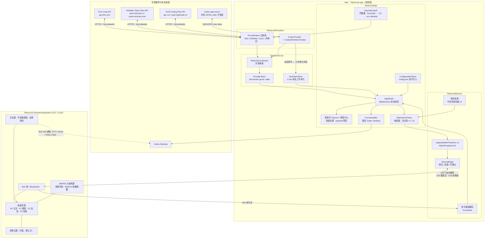
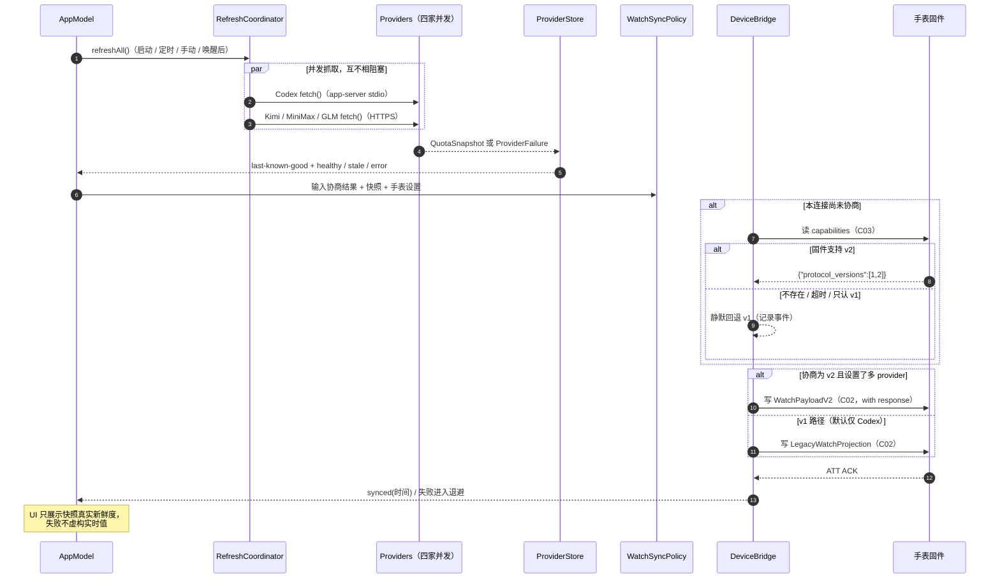
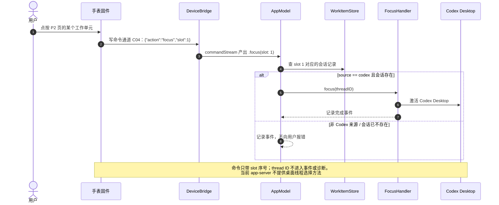
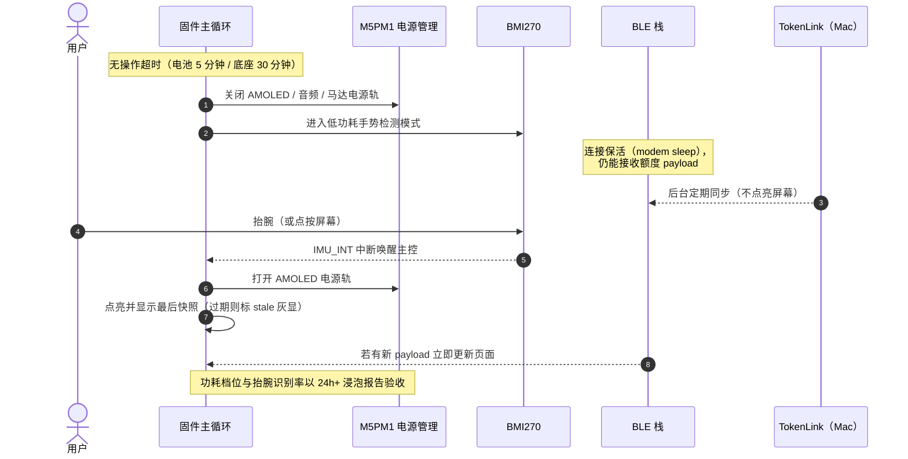

# TokenLink 表盘与协议 v2 架构图与时序图

状态：Mac/固件链路已在最终候选 C152 上验证；实体布局/触摸与长时功耗待验证

日期：2026-08-22

本文件是表盘 v2 设计文档的图解补充：一张系统架构图 + 三张关键时序图。
Mermaid 源码可直接在 GitHub / 支持 Mermaid 的 Markdown 查看器中渲染。

## 1. 系统架构图

要点：

- **两条独立 BLE 通道**：HID 通道（按键 → Codex Desktop，存量行为不变）与
  私有 GATT 服务（额度 payload + 协商 + 命令通道）。
- **依赖方向固定**：`App → Providers → Core`、`App → Device → Core`，
  Providers 与 Device 互不依赖。
- **WatchSyncPolicy 是纯函数**：输入协商结果 + 各家快照 + 手表设置，输出
  下一条 payload，便于全量单测。
- 隐私边界：越过 BLE 的只有配额数字、工作单元短名/状态、slot 命令；
  凭据、账户、任务文本不出 Mac。

## 2. 时序图：启动刷新 → 版本协商 → 同步

## 3. 时序图：点按工作单元 → 激活 Codex Desktop

## 4. 时序图：熄屏待机与抬腕唤醒

